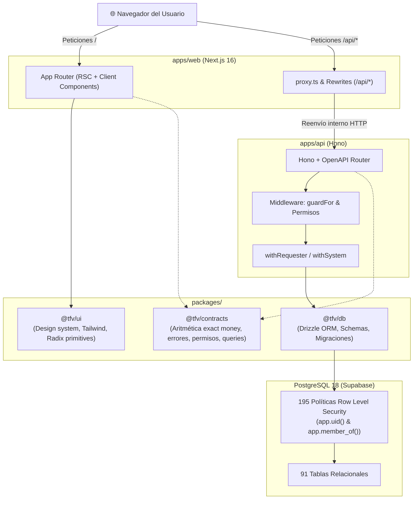

# 🏛️ Arquitectura del Sistema TFV

Este documento explica las decisiones de arquitectura, patrones de diseño y mecanismos de seguridad de **TFV (The Film Vault)**.

---

## 1. Visión General del Monorepo



---

## 2. Decisiones Transversales Críticas (D-01 a D-09)

Al desarrollar en TFV, estas 9 reglas son de obligado cumplimiento:

### D-01: Padrón Único de Identidad
Un usuario (`users`) es una entidad global identificada por su correo. La misma persona puede ser compradora en una tienda pública y miembro del equipo de otra empresa. Los permisos se determinan por el rol de la membresía activa en el contexto de la empresa consultada.

### D-02: Borrado Lógico en Negocio, Físico en Estructuras
- **Soft Delete (`deleted_at IS NULL`):** Empresas, usuarios, pedidos, cotizaciones, unidades de inventario, productos, producciones, etc.
  * *Unicidad parcial:* Los índices únicos excluyen filas borradas (ej. un correo se libera al borrar lógicamente la cuenta).
- **Hard Delete (Borrados en cascada de BD):** Filas de unión, líneas de detalle de cotización/pedido, membresías.

### D-03: Dinero en Decimal Exacto y Reparto de Residuos
- **Cero coma flotante:** Nunca uses `number` nativo de JavaScript para dinero.
- En la base de datos se guarda como `decimal(12, 2)` o `money(...)`.
- En transporte se maneja como cadena numérica (`"1250.50"`).
- Toda operación de cálculo usa las funciones puras de `@tfv/contracts`:
  $$\text{línea.total} = \text{round}(\text{precio} \times \text{cantidad}, 2)$$
  $$\text{subtotal} = \sum \text{líneas}$$
  Si un descuento o comisión se prorratea y genera fracciones de centavo, **el residuo se asigna automáticamente a la última línea** para garantizar que los totales impresos cuadren al centavo.

### D-06 y D-07: Aislamiento Multi-Tenant en Dos Capas
El aislamiento de datos se aplica en **dos niveles independientes**:
1. **Capa de Aplicación (Hono):** Valida la sesión, empresa y permisos (`guardFor`).
2. **Capa del Motor (PostgreSQL RLS):** Toda consulta se ejecuta mediante `withRequester`, que ejecuta:
   ```sql
   SET LOCAL ROLE authenticated;
   SET LOCAL "request.jwt.claims" = '{"sub": "user_uuid", "session_id": "session_uuid"}';
   ```
   Las 195 políticas RLS evalúan la función `app.uid()`, la cual valida en cada transacción que la sesión no haya sido revocada. Si la aplicación olvida filtrar por empresa, **el motor de base de datos bloquea el acceso devolviendo cero filas (*fail-closed*)**.

---

## 3. Patrón BFF y Manejo de Sesiones en Next.js

Para evitar lidiar con CORS complejo y problemas de cookies cross-domain:
1. El navegador **nunca llama directamente al puerto 5000 de la API**.
2. Todas las peticiones frontend se dirigen a `/api/*` en el puerto 3000.
3. `apps/web/next.config.ts` utiliza `rewrites` para reenviar silenciosamente `/api/:path*` hacia `http://localhost:5000/:path*`.
4. `apps/web/src/proxy.ts` inyecta los encabezados `x-pathname` y `x-forwarded-for` para preservar la IP real del cliente.
5. Los tokens de sesión se guardan en cookies `HttpOnly`, inaccesibles para JavaScript del cliente, protegiendo contra ataques XSS.

---

## 4. Estructura de Paquetes Compartidos

| Paquete | Responsabilidad | Dependencias permitidas |
|---|---|---|
| `@tfv/contracts` | Lógica pura: dinero, errores tipados, parser de filtros de búsqueda, catálogo de permisos. | **Cero dependencias de I/O o base de datos.** Solo lógica pura y Zod. |
| `@tfv/db` | Definición de tablas Drizzle, tipos inferidos, clientes transaccionales y migraciones SQL. | `drizzle-orm`, `postgres`. |
| `@tfv/ui` | Componentes visuales reutilizables, primitivos y tokens Tailwind. | `react`, `tailwind-merge`, `clsx`. |
